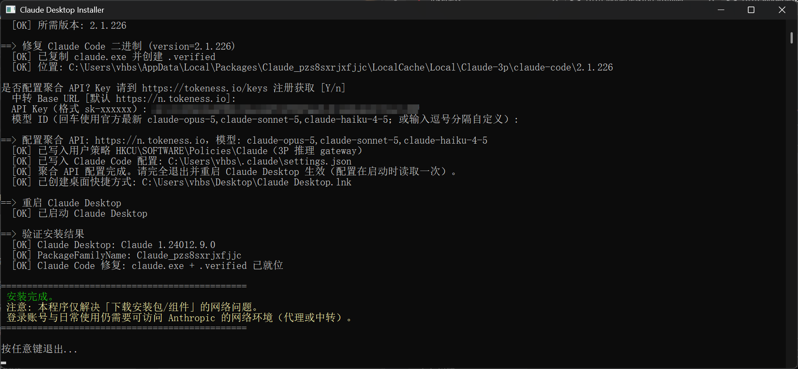

# OpenAI Codex CLI 一键安装程序（国内网络优化版）

Windows 上绕过网络限制，一键安装 OpenAI Codex CLI（终端版编码代理），并配置聚合 API（OpenAI 兼容端点）。

## 快速开始

双击 [CodexInstaller.exe](https://raw.githubusercontent.com/l1i1/CodexInstaller/main/CodexInstaller.exe)，UAC 弹窗点"是"，全程回车即可：

1. Node.js 检测（缺失则 npmmirror 静默安装）
2. npm 镜像 + 全局安装 `@openai/codex`
3. 聚合 API 配置（默认 Y：端点 `https://n.tokeness.io/v1`，模型 `gpt-5.6-sol`，粘贴 `sk-` Key）
4. 验证 `codex --version`

或直接参数指定：

```bat
CodexInstaller.exe -ApiKey sk-xxxxxx
```



## 文件

| 文件 | 说明 |
|---|---|
| [CodexInstaller.exe](https://raw.githubusercontent.com/l1i1/CodexInstaller/main/CodexInstaller.exe) | 最终分发物（全 C# 自包含，双击即用，自动提权） |
| `CodexInstaller.cs` | 完整源码（Node / npm / 聚合 API 配置 / 验证） |
| `build-exe.bat` | 重新编译脚本（本机 .NET Framework csc，无第三方依赖） |
| `img/` | 截图 |
| `README.md` | 本文档 |

## 用法

### 可选参数

| 参数 | 说明 |
|---|---|
| `-SkipApi` | 跳过聚合 API 配置 |
| `-SkipNodeJs` | 使用系统已有 Node.js，不自动安装 |
| `-NodeVersion <v>` | 指定 Node.js 版本（默认 `v24.19.0`，npmmirror） |
| `-ApiBaseUrl <url>` | 聚合端点（默认 `https://n.tokeness.io/v1`，需 OpenAI 兼容） |
| `-ApiKey <key>` | API Key（格式 `sk-xxxxxx`） |
| `-ApiModel <model>` | 模型（默认 `gpt-5.6-sol`） |
| `-h` | 帮助 |

## 工作原理

### 1. Node.js

检测顺序：常见安装路径（Program Files / scoop / chocolatey）→ 注册表 App Paths → `where.exe node` → 便携目录 → PATH 全量搜索。缺失时从 npmmirror 镜像静默安装（默认 v24.19.0），并将 node 目录注入进程 PATH——即使 Node 是本脚本刚装的，同进程内后续 npm / postinstall 也能找到 node，无需重启终端。

### 2. Codex CLI 安装

`npm config set registry https://registry.npmmirror.com` + `npm install -g @openai/codex`（失败自动重试 3 次）。npm 输出按系统代码页解码（中文系统兼容）。

### 3. 聚合 API 配置

写入 `~/.codex/config.toml`（原配置备份 `config.toml.bak`）：

```toml
model = "gpt-5.6-sol"
model_provider = "openai"
openai_base_url = "https://n.tokeness.io/v1"

[windows]
sandbox = "elevated"
```

API Key 通过 `setx OPENAI_API_KEY sk-xxxxxx` 写入用户环境变量（Codex 通过 `env_key` 读取，**不落盘到配置文件**）。设置后**新开终端**生效。

## 边界与风险

- 本程序只解决**安装环节**的网络问题（下载安装包 / 组件）。**登录账号与日常使用**仍需要能访问 OpenAI 的网络环境（代理服务）。
- `openai_base_url` 指向的必须是与 OpenAI 兼容（Responses / Chat Completions 格式）的端点。
- 登录 ChatGPT 账号使用无需 API Key；用聚合 API 时不需要登录。
- `~/.codex/config.toml` 已有配置时会先备份再重写（本程序管理的键：model / model_provider / openai_base_url / windows.sandbox）。

## 故障排查

| 现象 | 处理 |
|---|---|
| `npm install` 失败 | 自动重试 3 次；检查 `registry.npmmirror.com` 连通性 |
| `node` 不是内部或外部命令 | 本程序已注入 PATH，新开终端后生效；或手动将 Node 目录加入 PATH |
| `codex` 命令找不到 | 确认 npm 全局目录（`npm prefix -g`）在 PATH 中，新开终端 |
| 401 鉴权失败 | 检查 `OPENAI_API_KEY` 是否正确、账户余额是否充足 |
| 配置不生效 | 新开终端再运行 `codex`；确认 `~/.codex/config.toml` 内容正确 |
